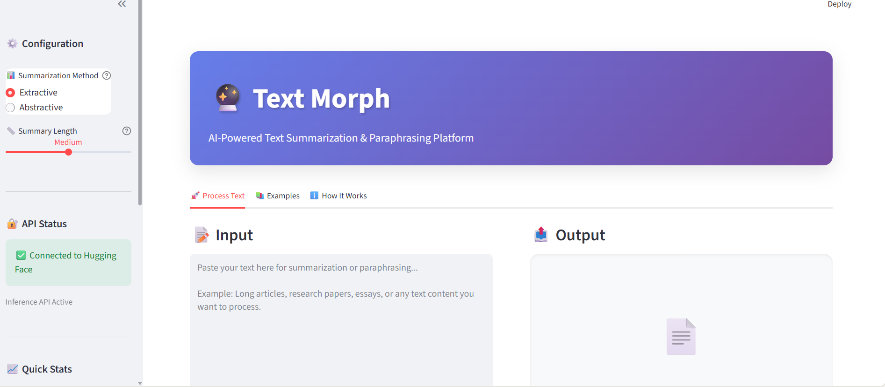
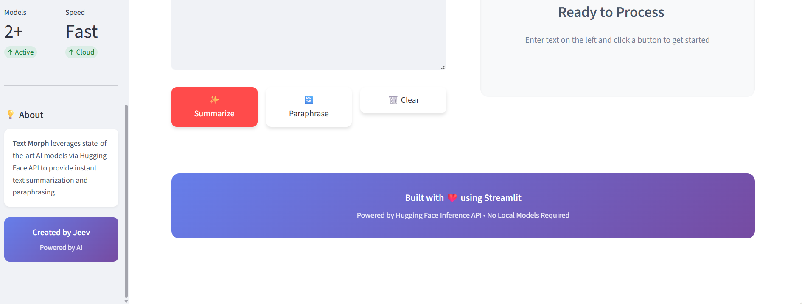

# 📑 Text Morph - Advanced Text Summarization and Paraphrasing

<div align="center">


*A beautiful, AI-powered web application that provides intelligent text summarization and paraphrasing using state-of-the-art language models.*

</div>

## 📸 Screenshot

Here is a preview of the application's user interface:




## 📋 Table of Contents

- [🎯 Project Overview](#-project-overview)
- [✨ Features](#-features)
- [🛠️ Technologies Used](#️-technologies-used)
- [🤖 AI Models](#-ai-models)
- [🚀 Quick Start](#-quick-start)
- [🔄 Usage](#-usage)
- [📈 Project Structure](#-project-structure)
- [🎨 UI Features](#-ui-features)
- [🤝 Contributing](#-contributing)
- [📄 License](#-license)

## 🎯 Project Overview

**Text Morph** is an advanced AI-powered text processing platform designed to help users quickly understand and rework lengthy content. It leverages state-of-the-art Natural Language Processing (NLP) models including Facebook's BART and Meta's LLaMA 3.1 to provide two core functionalities:

1. **Text Summarization**: Condense long documents into concise summaries using both extractive and abstractive methods
2. **Text Paraphrasing**: Rephrase content while maintaining its original meaning

The application features a modern, professional interface with gradient themes, smooth animations, and an intuitive design built with Streamlit. It's perfect for students, professionals, content creators, and researchers who need to process large amounts of text efficiently.

## ✨ Features

### 🎨 Modern User Interface
-   **Beautiful Gradient Design**: Professional purple gradient theme with smooth transitions
-   **Tab-Based Navigation**: Organized interface with Process Text, Examples, and How It Works tabs
-   **Responsive Layout**: Works seamlessly on desktop and mobile devices
-   **Real-Time Metrics**: Live character count, word count, and reduction percentage
-   **Smooth Animations**: Hover effects and transitions for enhanced user experience

### 🤖 AI-Powered Processing
-   **Dual Summarization Methods**:
    -   **Extractive**: Selects key sentences from the original text
    -   **Abstractive**: Generates new summary sentences using AI
-   **Intelligent Paraphrasing**: Natural language rephrasing with multiple variations
-   **Flexible Summary Lengths**: Choose from Short (30-60 words), Medium (60-130 words), or Long (130-200 words)

### ⚡ Performance & Convenience
-   **Fast Processing**: 2-5 second response time
-   **Cloud-Based**: No model downloads required
-   **Download Results**: Export summaries and paraphrased text as .txt files
-   **API Status Monitoring**: Real-time connection status display

## 🛠️ Technologies Used

| Technology | Purpose |
|------------|---------|
|  | Core programming language |
|  | Web application framework |
|  | BART model API access |
|  | LLaMA model inference API |
|  | HTTP library for API calls |
|  | Environment variable management |
|  | Custom styling and animations |

## 🤖 AI Models

### BART (Bidirectional and Auto-Regressive Transformers)
-   **Developer**: Facebook AI Research
-   **Model**: `facebook/bart-large-cnn`
-   **Parameters**: 406M
-   **Purpose**: Text summarization (both extractive and abstractive)
-   **Strengths**: High accuracy, contextual understanding, versatile for various text types

### LLaMA 3.1 (Large Language Model Meta AI)
-   **Developer**: Meta AI
-   **Model**: `llama-3.1-8b-instant`
-   **Parameters**: 8B
-   **Purpose**: Text paraphrasing
-   **Strengths**: Natural language generation, fast inference, maintains semantic meaning

## 🚀 Quick Start

### Prerequisites
- Python 3.8 or higher
- Hugging Face API key (free)
- GROQ API key (free)

### Installation

1. **Clone the repository**
   ```bash
   git clone https://github.com/yourusername/text-morph.git
   cd text-morph
   ```

2. **Create virtual environment**
   ```bash
   # Windows
   python -m venv venv
   venv\Scripts\activate

   # macOS/Linux
   python3 -m venv venv
   source venv/bin/activate
   ```

3. **Install dependencies**
   ```bash
   pip install -r requirements.txt
   ```

4. **Set up API keys**
   
   Create a `.env` file in the project root:
   ```env
   HF_API_KEY=your_huggingface_api_key_here
   GROQ_API_KEY=your_groq_api_key_here
   ```

   **Get your API keys:**
   - Hugging Face: https://huggingface.co/settings/tokens
   - GROQ: https://console.groq.com/keys

5. **Launch the application**
   ```bash
   streamlit run app.py
   ```

## 🔄 Usage

Once the setup is complete, you can start using Text Morph.

**1. Run the Streamlit App**

In your terminal, navigate to the project's root directory and run:
```bash
streamlit run app.py
```

**2. Access the Application**

Your default web browser will open automatically at `http://localhost:8501`

**3. Configure Settings (Sidebar)**
-   Select **Summarization Method**: Extractive or Abstractive
-   Choose **Summary Length**: Short, Medium, or Long
-   View **API Status** and quick stats

**4. Process Your Text**
-   Navigate to the **🚀 Process Text** tab
-   Paste or type your text in the input area
-   Click **✨ Summarize** for text summarization
-   Click **🔄 Paraphrase** for text paraphrasing
-   View real-time metrics (word count, character count, reduction %)

**5. Download Results**
-   Click the **⬇️ Download** button to save your results as a .txt file

**6. Explore Examples**
-   Check the **📚 Examples** tab for use case ideas
-   Read the **ℹ️ How It Works** tab for detailed explanations

## 📈 Project Structure

```
TEXT_MORPH/
│
├── 📁 __pycache__/                 # Python cache files
│
├── 📁 assets/                      # Static assets
│   ├── screenshot1.png             # Application screenshot 1
│   └── screenshot2.png             # Application screenshot 2
│
├── 📁 configure/                   # Configuration files
│   ├── config_manager.py           # Configuration manager
│   └── config.yaml                 # Application configuration
│
├── 📁 docs/                        # Documentation
│   ├── API_Docs.md                 # API documentation
│   └── Technical_Report.md         # Technical report
│
├── 📁 myenv/                       # Virtual environment (not in repo)
│
├── 📁 src/                         # Source code
│   ├── __pycache__/                # Python cache
│   ├── __init__.py                 # Package initializer
│   ├── .env                        # Environment variables (API keys)
│   ├── AbstractiveSummarizer.py    # Abstractive summarization module
│   ├── combinedPipeline.py         # Main pipeline orchestrator
│   ├── exceptions.py               # Custom exception classes
│   ├── ExtractiveSummarizer.py     # Extractive summarization module
│   ├── logging_system.py           # Logging configuration
│   └── paraphraser.py              # Text paraphrasing module
│
├── .gitignore                      # Git ignore rules
├── app.py                          # Main Streamlit application
├── pyproject.toml                  # Project metadata
├── README.md                       # Project documentation (this file)
└── requirements.txt                # Python dependencies
```

## 🎨 UI Features

### Header Section
-   **Gradient Background**: Beautiful purple gradient (#667eea to #764ba2)
-   **Bold Branding**: Large "Text Morph" title with crystal ball emoji
-   **Clear Subtitle**: "AI-Powered Text Summarization & Paraphrasing Platform"

### Sidebar Components
-   **⚙️ Configuration Panel**: Method and length selection with helpful tooltips
-   **🔐 API Status**: Real-time connection indicator
-   **📈 Quick Stats**: Live metrics for active models and processing speed
-   **💡 About Section**: Project information card
-   **Creator Badge**: Professional footer with creator name

### Main Interface
-   **Tab Navigation**: Three organized tabs for different purposes
-   **Two-Column Layout**: Input on left, output on right
-   **Real-Time Stats**: Character and word counting
-   **Empty State**: Beautiful placeholder when no content
-   **Feature Cards**: Hover-animated cards showcasing use cases
-   **Download Integration**: One-click export functionality

### Visual Design Elements
-   Custom CSS with smooth transitions
-   Hover effects on buttons and cards
-   Professional color scheme
-   Responsive grid layouts
-   Shadow effects for depth
-   Rounded corners throughout

## 🤝 Contributing

Contributions are welcome! Here's how you can help:

1. 🍴 Fork the repository
2. 🌿 Create a feature branch (`git checkout -b feature/AmazingFeature`)
3. 💾 Commit your changes (`git commit -m 'Add some AmazingFeature'`)
4. 📤 Push to the branch (`git push origin feature/AmazingFeature`)
5. 🔄 Open a Pull Request

### Ideas for Contributions:
- 🌙 Dark mode toggle
- 🌍 Multi-language support
- 📄 PDF/DOCX file upload
- 📊 Batch processing capabilities
- 📝 History tracking feature
- 🎨 Additional theme options
- 🤖 More AI model options
- 📱 Progressive Web App (PWA) features

## 📄 License

This project is licensed under the MIT License - see the [LICENSE](LICENSE) file for details.

---

<div align="center">

### 🌟 If you found this project helpful, please give it a star! ⭐

**Created with ❤️ by Jeev | Powered by AI**

[Report Bug](https://github.com/yourusername/text-morph/issues) · [Request Feature](https://github.com/yourusername/text-morph/issues)

</div>

---
=======
Create a virtual environment:

python -m venv venv 


Here, venv is the folder name (you can use any name).

Activate the virtual environment:

On Windows:

venv\Scripts\activate
>>>>>>> ed02a9d4ed59cc987f7c9c16bf3dce8d55b7208b
